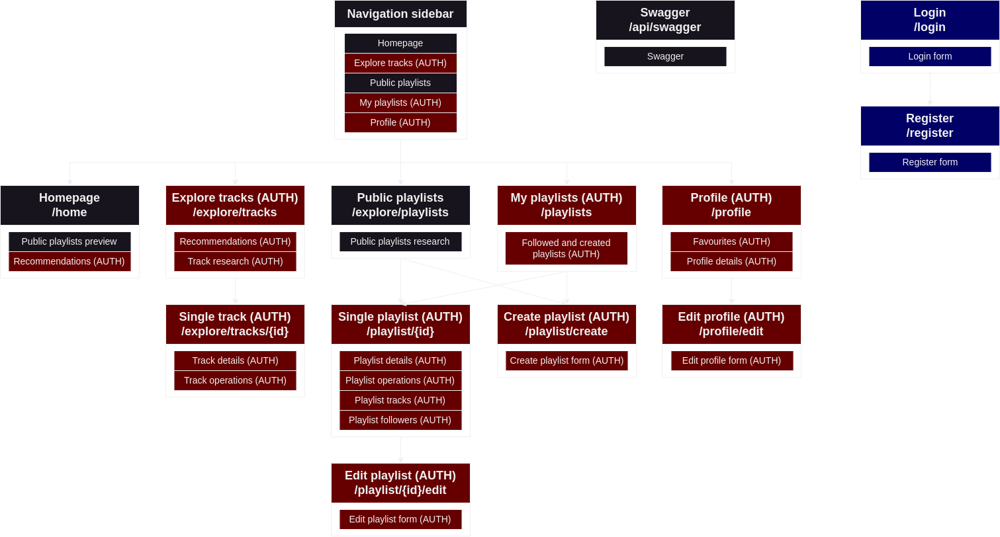

# Relazione

Relazione del progetto _"Social Network for Music"_ per il corso _"Programmazione e linguaggi per il web"_ (a.a. 2022-2023, appello di Giugno).

Realizzata da Luca Favini (matricola 987617).

- [Testing e Deploy](#testing-e-deploy)
- [Struttura del progetto](#strutturra-del-progetto)
  - [Stack tecnologico](#stack-tecnologico)
  - [Organizzazione codice](#organizzazione-codice)
- [Struttura del sito web](#struttura-del-sito-web)
- [Scelte implementative significative](#scelte-implementative-significative)
  - [Autenticazione ed Autorizzazione (`JWT`)](#autenticazione-ed-autorizzazione-jwt)
    - [Accesso endpoint API protetti (middleware `authenticateUser`)](#accesso-endpoint-api-protetti-middleware-authenticateuser)
    - [Accesso pagine web protette (hook `useauth`)](#accesso-pagine-web-protette-hook-useauth)
  - [Memorizzazione token Spotify](#memorizzazione-token-spotify)
    - [Refresh token](#refresh-token)
  - [Requests validation](#requests-validation)
    - [Pacchetto Zod](#pacchetto-zod-per-validazione-backend)
  - [Debouncing richieste API](#debouncing-richieste-api)
  - [Gestione generi](#gestione-generi)
  

## Testing e Deploy

Il sito web è disponibile all'indirizzo: [snm.favo02.dev](https://snm.favo02.dev).\
Il codice sorgente è disponibile all'indirizzo: [github.com/Favo02/social-network-for-music](https://github.com/Favo02/social-network-for-music).

Istruzioni per avviare l'applicazione - **fase di testing** (react in modalità di development, backend che si riavvia ad ogni file modificato):

- Clonare il codice sorgente:
  - `git clone https://github.com/Favo02/social-network-for-music`
- Installare i `node_modules` sia per il `frontend` che per il `backend`:
  - `cd frontend; npm install;`
  - `cd ../backend; npm install;`
- Aggiungere file `.env` alla root della cartella `backend`:
  - `cp /path/to/.env ./backend/.env`
  - Il file contiene le seguenti variabili di ambiente:
    - `PORT`: porta su cui il backend sarà in ascolto
    - `SECRET`: parola segreta per l'hashing delle password
    - `MONGODB_URI`: URI del server mongodb
    - `CLIENT_ID`: id per generare token spotify
    - `CLIENT_SECRET`: segreto per generare token spotify
  - _Un file `.env` completo di esempio è stato caricato su upload_
- Avviare frontend e backend (in due terminali separati):
  - `cd frontend; npm start`
  - `cd backend; npm run dev`
- Il sito sarà raggiungibile all'indirizzo [`http://localhost:3000/`](http://localhost:3000/)
- L'API sarà raggiungbile all'indirizzo [`http://localhost:3003/api/`](http://localhost:3003/api/)

Per generare una build per la **fase production** (codice sorgente react compilato in una versione ottimizzata di production, backend non si riavvia)\:

_Istruzioni per le fasi ripetute da sopra omesse_

- Clonare il codice sorgente
- Installare i `node_modules` sia per il `frontend` che per il `backend`
- Aggiungere il file `.env` alla root della cartella `backend`
- Generare una build di react:
  - `cd frontend; npm run build`
- Spostare la build dentro la cartella `backend`:
  - `mv -r ./frontend/build ./backend`
- Avviare solo il backend:
  - `cd backend; npm start`
- Il sito sarà raggiungibile all'indirizzo [`http://localhost:3003`](http://localhost:3003)
- L'API sarà raggiungibile all'indirizzo [`http://localhost:3003/api`](http://localhost:3003/api)

## Strutturra del progetto

Ho diviso il progetto in parte frontend e parte backend, completamente indipendenti, ogni parte con la propria cartella (`/frontend`, `/backend`).

### Stack tecnologico

**Frontend** (in `TypeScript`):

- `React`
- Client-side routing: `react-router`
- Styling delle pagine (css e responsive): `tailwindcss`
- Richieste HTTP: `axios`

**Backend** (in `JavaScript`):

- `Express`
- Comunicazione con il database: `mongoose`
- Gestione autorizzazioni (sessioni): `jsonwebtoken` (`JWT`)

**Database**:

- `MongoDB`

**Utilità**:

- Validazione oggetti javascript: `zod` _(backend)_
- Password hashing: `bcrypt` _(backend)_
- Linting del codice: `eslint` _(con ulteriore github action)_
- Versionamento automatico: `gitversion` _(grazie a github action)_
- Deploy: `docker` _(automatizzato con github action)_

### Organizzazione codice

**Frontend**:

Il progetto è organizzato in più pagine, la cui navigazione è gestita lato client (`react-router`). Ogni pagina viene popolata dinamicamente con delle richieste asincrone all'API (`axios`).

Il routing delle varie pagine è gestito nel file `src/App.tsx`. Tutte le pagine sono salvate nella cartella `src/pages` ed ogni pagina è un componente `React` (a sua volta composto da altri componenti).

Le richieste all'API avvengono chiamando delle funzioni specifiche chiamate servizi (`src/services`), che mandano delle richieste asincrone al backend componendo correttamente URL, parametri ed headers.

Il frontend è inoltre completamente responsive, per poter essere utilizzato anche su dispositivi mobile.

Struttura cartelle (in `src/`):

- `assets`: contenuti statici (stili css, font, immagini)
- `components`: componenti di cui sono composte le pagine (organizzati in sottocartelle in base alla loro natura)
- `hooks`: react hook personalizzati 
- `interfaces`: interfacce che rappresentano i vari tipi di dato (Typescript)
- `pages`: pagine del sito
- `services`: servizi per scambiare dati con l'API
- `utils`: varie utilità

**Backend**:

Il backend che espone l'API è organizzato in vari router (`src/controllers`), ognuno gestisce diversi endpoint, raggruppati per natura. Tutti i router sono poi utilizzati dal server `express` (`src/app.js`) per esporre una API REST.

Struttura cartelle (in `src/`):

- `controllers`: router che gestiscono i vari endpoint
- `db`: connessione con il database
- `middlewares`: middleware (funzioni intermedie prima dei router)
- `models`: modelli di dato presenti nel database
- `spotify_utils`: utilità per comunicare con l'API di Spotify
- `utils`: varie utilità
- `validations`: utilità per validare oggetti

È anche esposto uno swagger (in development: [`http://localhost:3003/api/swagger`](http://localhost:3003/api/swagger), in production: [`https://snm.favo02.dev/api/swagger`](https://snm.favo02.dev/api/swagger)), generato ad ogni avvio del file `src/utils/swaggerGenerator.js`, che poi avvia il server da `src/index.js`

## Struttura del sito web



_Rosse (AUTH): autorizzazione necessaria, utenti loggati._\
_Blu: accessibili solo se l'utente non è loggato._\
_Nere: accessibili sia da utenti loggati che da utenti anonimi._

## Scelte implementative significative

- [Autenticazione ed Autorizzazione (`JWT`)](#autenticazione-ed-autorizzazione-jwt)
  - [Accesso endpoint API protetti (middleware `authenticateUser`)](#accesso-endpoint-api-protetti-middleware-authenticateuser)
  - [Accesso pagine web protette (hook `useauth`)](#accesso-pagine-web-protette-hook-useauth)
- [Memorizzazione token Spotify](#memorizzazione-token-spotify)
  - [Refresh token](#refresh-token)
- [Requests validation](#requests-validation)
  - [Pacchetto Zod](#pacchetto-zod-per-validazione-backend)
- [Debouncing richieste API](#debouncing-richieste-api)
- [Gestione generi](#gestione-generi)

## Autenticazione ed autorizzazione (`JWT`)

Per gestire le autorizzazioni di accesso alle varie pagine e ai vari endpoint dell'API ho utilizzato un meccanismo basato sui `JavascriptWebToken` (`JWT`) e i `React hook` personalizzati:

- un utente effettua il login mandando all'endpoint `/login` una richiesta POST con username e password
- in caso le credenziali siano corrette il server genera un `JWT` e lo invia al client nella risposta
- il client si salva questo token (nella `localStorage`):
  - può inviare richieste con gli endpoint dell'API protetti, allegando il token ad ogni richiesta
  - può accedere alle pagine protette del frontend: avviene una verifica con il componente `ProtectedRoute` e l'hook `useAuth`

### Accesso endpoint API protetti: middleware `authenticateUser`

Gli endpoint che richiedono l'autenticazione e l'autorizzazione dell'utente che invia la richiesta utilizzano il middleware (funzione che viene interposta tra la richiesta e il router) `authenticateUser`, che effettua:

- verifica presenza del token `JWT` tra gli `Authorizazion header` nella richiesta
- verifica genuinità del token decodificandolo
- se valido, associa alla richiesta le informazioni dell'utente (id e username)

_Snippet: middleware `authenticateUser`_

```javascript
const authenticateUser = (req, res, next) => {

  if (!req.headers.authorization) {
    return res.status(401).json({ error: "missing token" })
  }

  try {
    const token = req.headers.authorization
    jwt.verify(token, config.SECRET)

    const jwtPayload = jwt.decode(token)

    req.user = {
      username: jwtPayload.username,
      id: jwtPayload.id
    }
  }
  catch (err) {
    return res.status(401).json({ error: "invalid token" })
  }

  next()
}
```

_Snippet: endpoint non protetto_

```javascript
loginRouter.post("/", async (req, res) => {
  // req.user : undefined
})
```

_Snippet: endpoint protetto_

```javascript
usersRouter.get("/me", authenticateUser, async (req, res) => {
  // req.user : { id: string, username: string }
})
```

### Accesso pagine web protette: hook `useAuth`

La verifica delle autorizzazioni di un utente lato frontend (per non far accedere a pagine protette) viene effettuata attraverso l'uso di un hook custom `useAuth`, che effettua:

- controlla la presenza del token `JWT` in localstorage
- effettua una richiesta all'endpoint dell'API `/login/verify` per verificare che il token sia valido (e non scaduto)
- in caso sia valido imposta lo stato `auth` a `true`

Le pagine che hanno bisogno di autorizzazione per essere accedute verificano attraverso questo hook che `auth` sia `true`, altrimenti redirigono alla pagina `/login`.

_Snippet: `useAuth` hook_

```javascript
const useAuth = () => {
  const [auth, setAuth] = useState(false)
  const [isLoading, setIsLoading] = useState(true)

  useEffect(() => {
    const authenticate = async () => {

      const token = localStorage.getItem("token")

      if (!token) {
        setAuth(false)
        setIsLoading(false)
        return
      }

      try {
        await loginService.verify(token)
        setAuth(true)
      }
      catch (err) {
        setAuth(false)
      }
      finally {
        setIsLoading(false)
      }
    }

    authenticate()
  }, [])

  return [auth, isLoading]
}
```

## Memorizzazione token Spotify

Ho deciso di fornire una API REST completa, che comprende anche le operazioni che includono comunicazione con Spotify, in modo che il frontend comunichi solo con il mio backend e non anche con l'API di Spotify.

Ho preso questa decisione per motivi di sicurezza: per generare un token dell'API di Spotify sono necessarie due stringhe univoche (`CLIENT_ID` e `CLIENT_SECRET`) legate al mio personale account e far generare un token al frontend avrebbe significato esporre pubblicamente questi due segreti.

- Il frontend non fa mai richieste direttamente all'API di Spotify, passa sempre dal mio backend
- Il backend si occupa di gestire (generare, memorizzare e rinnovare) il token di accesso a Spotify, in modo del tutto trasparente al frontend
- Il backend salva il token in una variabile locale (`app.locals`), dato che è un informazione non persistente e che deve venir rigenerata spesso (ogni ora) non credo sia necessario utilizzare forme di memorizzazione più complesse

### Refresh token

Tutti gli endpoint `/api/spotify/...` non controllano inizialmente la presenza e validità di un token Spotify, dato che significherebbe fare una richiesta qualsiasi a Spotify (non esiste un endpoint di verifica sull'API Spotify) e controllare che la risposta sia positiva (2xx).

Viene effettuata la richiesta specifica necessaria in quel momento (quella che viene richiesta dal frontend) e in caso di errore 401 viene generato un nuovo token e riprovata la richiesta. Vengono anche controllati eventuali ulteriori errori (in particolare 401 in caso non si riesca a generare un token valido e 429 in caso di rate limit exceeded).

_Snippet: tentativo di richiesta a spotify (ed eventuale refresh)_

```javascript
let spotifyResponse = await fetchSpotify.albums(token, query)

// invalid token: refresh spotify token and retry one time
if (spotifyResponse.status === 401) {
  const token = await generateSpotifyToken(req.app)
  spotifyResponse = await fetchSpotify.albums(token, query)
}

// check for spotify api errors after token refresh
// undefined == no errors
const errorJson = checkSpotifyError(spotifyResponse.status)

return res
  .status(spotifyResponse.status)
  // if error found return errorJson, otherwise response json
  .json(errorJson ?? await spotifyResponse.json())
```

## Requests validation

Ho implementato una validazione di tutti i possibili input dell'utente, ridondante su più livelli:

- a livello di frontend: viene bloccata la richiesta ancora prima di essere inviata al frontend (verifica di regex)
- a livello di backend: i controller degli endpoint verificano le richieste e le sanificano (`/backend/src/validations`, con il pacchetto `zod`)
- a livello di database: ogni tabella ha uno schema di oggetto che può essere inserito al suo interno, in caso si missmatch l'oggetto viene rifiutato (`/backend/src/models`)

Questo garantisce che anche se venissero mandate eventuali richieste all'API senza passare dal frontend gli input siano comunque sanificicati ed addirittura anche se in qualche modo si riuscisse ad inserire degli oggetti nel database senza passare dal backend, mongo li accetta solo correttamente composti.

### Pacchetto Zod per validazione (backend)

Per validare le richieste lato backend ho utilizzato una libreria di parsing e validazione di oggetti: [`zod`](https://zod.dev).
Questa mi permette di definire uno schema per un oggetto e verificarne la corretta composizione (operazione che in javascript è un incubo essendo un linguaggio loosely typed)

_Snippet: validazione oggetto ricevuto dall'endpoint che crea un nuovo utente_

```javascript
const CreateUserSchema = z.object({
  username: z.string().regex(regex.username, { message: regex.usernameDesc }),
  password: z.string().regex(regex.password, { message: regex.passwordDesc }),
  email: z.string().regex(regex.email, { message: regex.emailDesc })
})
```

_Snippet: verifica dello schema_

```javascript
try {
  const parsed = CreateUserSchema.parse(input)
  return { valid: true, parsed }
}
catch(e) {
  return { valid: false, message: formatErrorMessage(e.errors) }
}
```

Un altro grosso vantaggio di questo metodo è che con il parsing vengono automaticamente rimossi tutti i campi extra non presenti nello schema, particolarmente utile quando vanno gestiti oggetti molto complessi come quelli restituiti dall'API di Spotify.

_Snippet: parsing di una Track, vengono salvate solo le informazioni necessarie e contenute nello schema_

```javascript
const { track } = req.body

// validate
const { valid, message, parsed } = validateTrack(track)
if (!valid) {
  return res.status(400).json({ error: `Invalid track${message}` })
}

// ...

playlist.tracks.push(parsed) // oggetto parsato, senza campi superflui
const savedPlaylist = await playlist.save()
```

## Debouncing richieste API

Le funzionalità frontend di ricerca richiederebbero l'invio di tante richieste in un periodo di tempo molto ridotto, una ogni pressione di un tasto (durante la composizione della stringa da ricercare):

- ricerca di una canzone in `/explore/tracks`
- ricerca di un artista da aggiungere ai preferiti in `/profile`

Questo comporta l'invio di tante richieste quasi in simmultanea e l'aggiornamento dei dati visualizzati con il risultato della richiesta che impiega più tempo ad essere risolta.

Per risolvere questo problema (e alleggerire il carico di richieste inviate all'API) ho utilizzato il meccanismo del debouncing:

- alla pressione di un tasto per la ricerca viene scatenata la richiesta all'API, ma solo dopo un ritardo di 300ms
- in caso venga premuto un altro tasto (prima che i 300ms scadano) viene fermato l'invio della richiesta precedente

Quindi la richiesta parte solo se nessun tasto è premuto per almeno 300ms, quindi se l'utente ha finito o ha fermato la digitazione della query di ricerca.

_Snippet: debouncing_

```javascript
// debounce
const timeoutId = setTimeout(() => {
  handleSearch() // API call
}, 300)

// clear debounce (component re-render or unmount)
return () => clearTimeout(timeoutId)
```

## Gestione generi

L'API di Spotify presenta diversi problemi nella gestione dei generi di canzoni (tracks) o artisti (artists):

- Non sempre _(praticamente mai)_ viene restituito un genere nella richiesta di una canzone (sia utilizzando `/track` che `/search`)
  - Workaround: effettuare una ulteriore richiesta all'API di Spotify, richiedendo i dettagli dell'artista della canzone ed utilizzare ed utilizzando i generi principali dell'artista come genere della canzone (problematico in caso un artista pubblichi canzoni di generi differenti o per canzoni con più artisti con generi diversi tra loro)
- In caso sia presente, il genere NON è limitato alla lista di generi su cui è possibile filtrare ricerche o generare raccomandazioni (esistono [126](https://developer.spotify.com/documentation/web-api/reference/get-recommendation-genres) generi su cui è possibile effettuare operazioni a fronte dei [1383](https://gist.github.com/andytlr/4104c667a62d8145aa3a) generi che possono essere associati ad un artista o canzone)


Per queste ragioni (soprattutto il secondo problema, a cui non ho trovato una soluzione efficace e attuabile) ho deciso semplicemente di omettere i generi nella visualizzazione di canzoni e playlist, dato che sarebbero stata un informazione praticamente inutile (oltre che molto dispendiosa da ottenere, sarebbe stata necessaria una richiesta per ogni canzone).

I generi (solo i 126 effettivamente utilizzabili) sono comunque selezionabili come generi preferiti da parte di un utente (nella pagina profilo), che contribuiscono alla personalizzazione delle raccomandazioni.
